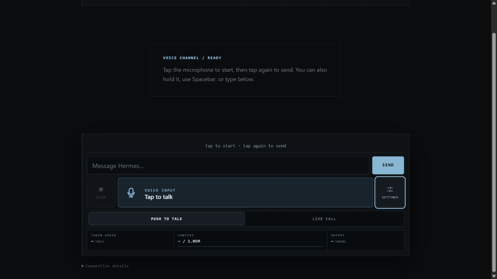
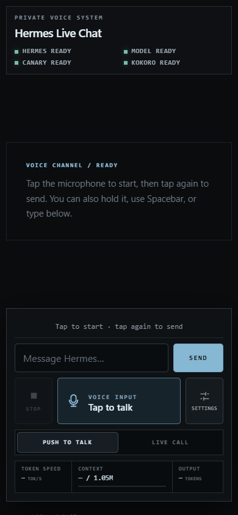
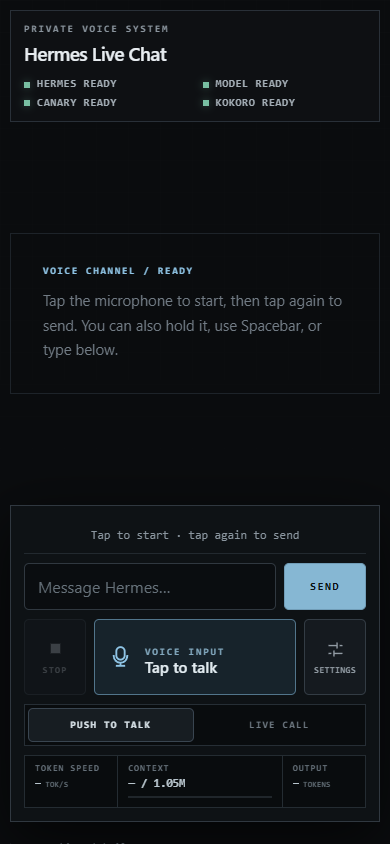
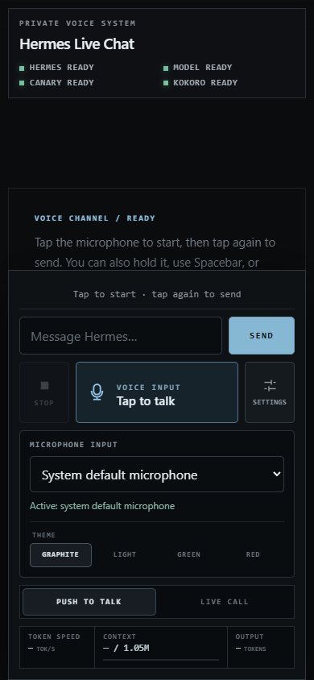

# Hermes Live Chat

Hermes Live Chat is a local-first, mobile-friendly voice and text interface for the [Hermes Agent](https://github.com/NousResearch/hermes-agent). It is designed to run on your own hardware and reach your phone privately through Tailscale. It adds a polished hands-free conversation layer without replacing Hermes' model routing, tools, skills, memory, MCP connections, or configuration.

The interface is model-agnostic: every turn goes through a selected Hermes profile, so changing the underlying model does not require frontend or application changes.



## Connect your phone through Tailscale

Hermes Live Chat is built around a private Tailscale connection. Install Tailscale on both the host running Hermes and your phone, sign both devices into the same tailnet, then publish the local app from the host:

```bash
tailscale serve --bg --https=443 /voice http://127.0.0.1:8765
tailscale serve status
```

Open the private address on your phone:

```text
https://YOUR-MACHINE.YOUR-TAILNET.ts.net/voice/
```

Tailscale provides the HTTPS origin required by mobile microphone permissions while keeping the page available only to devices in your tailnet. You do not need to expose port 8765 to the public internet.

## Features

- Push to Talk by tap, press-and-hold, or Spacebar
- Live Call with automatic end-of-speech detection
- Open Mic, Wake: Hermes, and fully Muted call states
- Selectable browser microphone input
- Local Canary 180M Flash transcription with faster-whisper fallback
- Immediate spoken acknowledgement while longer tasks run
- Local Kokoro speech with queued playback, Stop, and Replay controls
- Persistent Hermes conversations per browser
- Typed chat alongside voice input
- Inline images, audio, video, previews, and downloadable files created by Hermes
- Live model token speed, output-token count, and context usage
- Graphite, Light, Green, and Red themes with saved preference
- Responsive phone and desktop layout
- Private mobile access through Tailscale HTTPS

## Why it exists

The main use case is replacing Telegram as the remote chat surface for a personal Hermes agent. Instead of sending requests, conversation history, generated files, and voice recordings through a Telegram bot, Hermes Live Chat connects your phone directly to the agent running on your own hardware.

With a fully local Hermes profile, speech recognition, model inference, conversation state, generated attachments, and speech synthesis all stay on your machine. Tailscale supplies the encrypted private route to that machine without publishing the interface to the open internet. If you configure Hermes with a hosted model provider, that provider's privacy terms still apply.

This project is developed and tested on an **NVIDIA DGX Spark**, but it is not tied to the Spark or to one specific model.

## See it in action

The GIF below was captured from the running DGX Spark deployment. It shows a real request, the immediate spoken acknowledgement, the working state, and Hermes' final response.



[Listen to Hermes speak the local privacy response (MP3)](docs/assets/hermes-private-local.mp3)

GIF files cannot carry audio, so the spoken response is provided as a separate clip.

## Screenshots

Phone layout:



Microphone and theme settings:



## How it works

```text
Browser microphone or typed message
              |
              v
Canary speech-to-text (voice only)
              |
              v
Named Hermes conversation
  - model routing
  - tools and MCP servers
  - memory and project context
  - skills and system instructions
              |
              v
Hermes' currently configured model
              |
              +------> generated attachments
              |
              v
Kokoro speech synthesis
              |
              v
Browser text, audio, replay, and downloads
```

The browser stores a random session ID locally. The server maps it to a safe, durable Hermes conversation name, preserving context between follow-up turns and page reloads.

Wake mode locally transcribes nearby utterances so it can recognize “Hermes.” Speech without the wake word is ignored and is not sent to the model or added to the conversation.

## Requirements

- Linux and Python 3.11 or newer
- Hermes installed and configured with a working profile
- A model provider supported by Hermes
- `ffmpeg` for browser audio conversion
- Canary `transcribe.cpp` plus its GGUF model, or faster-whisper
- A compatible Kokoro Studio API for spoken responses
- Tailscale Serve for the intended private phone-to-agent connection

## Install

```bash
git clone https://github.com/TravisTeam/hermes-live-chat.git ~/hermes-live-chat
cd ~/hermes-live-chat
python3 -m venv .venv
. .venv/bin/activate
python -m pip install -U pip
python -m pip install -e '.[test]'
```

Place the Canary executable and model at the project-relative defaults below, or set their environment variables:

```text
vendor/transcribe.cpp/build/bin/transcribe-cli
models/canary-180m-flash/canary-180m-flash-Q8_0.gguf
```

Run the tests:

```bash
.venv/bin/pytest -q
```

## Launch

For development:

```bash
cd ~/hermes-live-chat
. .venv/bin/activate
export VOICE_AGENT_HERMES_PROFILE=default
export VOICE_AGENT_MODEL_SERVER_URL=http://127.0.0.1:8888
export VOICE_AGENT_KOKORO_URL=http://127.0.0.1:8880
uvicorn voice_agent.server:app --host 0.0.0.0 --port 8765
```

Open `http://127.0.0.1:8765`. For a persistent user service:

```bash
mkdir -p ~/.config/systemd/user
cp deploy/hermes-live-chat.service ~/.config/systemd/user/
systemctl --user daemon-reload
systemctl --user enable --now hermes-live-chat.service
systemctl --user status hermes-live-chat.service
```

Follow logs with `journalctl --user -u hermes-live-chat.service -f`.

Edit the service file if your checkout is not at `~/hermes-live-chat`, then copy it again and reload systemd.

## Designed for Tailscale

Hermes Live Chat is intended to sit behind Tailscale. Mobile browsers require a secure origin for microphone capture, and Tailscale Serve provides HTTPS while keeping the service inside your private tailnet:

```bash
tailscale serve --bg --https=443 /voice http://127.0.0.1:8765
tailscale serve status
```

Then open your device's tailnet HTTPS address at `/voice/`. Keep the route private unless you add authentication suitable for internet exposure.

## Changing the model

Hermes Live Chat never hard-codes a model into a chat request. It invokes the Hermes profile selected by `VOICE_AGENT_HERMES_PROFILE`, leaving inference routing with Hermes.

To switch models:

1. Configure the new provider and model in Hermes.
2. Point the selected Hermes profile at it.
3. Verify the route with `hermes --profile default chat --query "Reply with: model route works"`.
4. Set `VOICE_AGENT_MODEL_SERVER_URL` to the model server if you want health, model-name, context, and vLLM performance metrics.
5. Restart Hermes Live Chat.

No frontend or Python changes are required. Providers without vLLM-compatible `/metrics` keep chat functional, but performance fields display as unavailable.

## Configuration

| Variable | Default | Purpose |
|---|---|---|
| `VOICE_AGENT_HERMES_PROFILE` | `default` | Hermes profile that owns routing, tools, and memory |
| `VOICE_AGENT_MODEL_SERVER_URL` | `http://127.0.0.1:8888` | Optional health, model, context, and vLLM metrics endpoint |
| `VOICE_AGENT_KOKORO_URL` | `http://127.0.0.1:8880` | Kokoro Studio API |
| `VOICE_AGENT_KOKORO_OUTPUT_DIR` | unset | Optional host path for a Docker-mounted Kokoro output directory |
| `VOICE_AGENT_KOKORO_VOICE` | `af_heart` | Spoken voice |
| `VOICE_AGENT_KOKORO_SPEED` | `1.0` | Speech speed |
| `VOICE_AGENT_STT_ENGINE` | `canary` | Primary transcription engine; falls back to Whisper |
| `VOICE_AGENT_CANARY_BINARY` | project-relative path | Canary CLI executable |
| `VOICE_AGENT_CANARY_MODEL` | project-relative path | Canary GGUF model |
| `VOICE_AGENT_CANARY_LANGUAGE` | `en` | Transcription language |
| `VOICE_AGENT_CANARY_THREADS` | `8` | Canary CPU threads |
| `VOICE_AGENT_WHISPER_MODEL` | `base` | Fallback Whisper model |
| `VOICE_AGENT_WHISPER_DEVICE` | `auto` | Fallback Whisper device |
| `VOICE_AGENT_WHISPER_COMPUTE_TYPE` | `default` | Fallback Whisper compute type |
| `VOICE_AGENT_ARTIFACT_DIR` | `~/.local/share/hermes-live-chat/artifacts` | Persistent per-session files |
| `VOICE_AGENT_TEMP_DIR` | `/tmp/hermes-live-chat` | Temporary uploaded audio |

## Attachments

When a request asks for a deliverable, Hermes is instructed to save the finished file inside the browser session's artifact directory. The server detects new or modified files and sends attachment events automatically.

- Raster images render inline.
- Audio and video use native playback controls.
- Documents and other files receive Preview and Download actions.
- Saved session attachments return after refresh or reconnect.
- HTML, SVG, and other active formats are served with a restrictive sandbox and `nosniff` headers.
- Artifact routes cannot access files outside the configured artifact root.

## Resource usage

The web application itself is lightweight and does not allocate GPU memory. On one DGX Spark deployment, the running service used about **54 MiB of system memory** with a measured peak near **277 MiB**.

The optional AI services dominate hardware use and vary by model and configuration. In that same deployment:

- The active local language model used about **95.2 GiB** of GPU/unified memory.
- Kokoro used about **1.74 GiB** of GPU memory and **2.4 GiB** of container memory.

These are observed examples, not minimum requirements. A smaller model, hosted provider, CPU transcription, or different TTS stack will change the total substantially.

## API

- `GET /api/health` — Hermes, active model, STT, and Kokoro status
- `GET /api/config` — safe runtime configuration and detected model
- `GET /api/llm-metrics` — model counters and context limit
- `GET /api/artifacts/{session_id}` — persistent files for one browser conversation
- `POST /api/transcribe` — local audio transcription
- `POST /api/chat-stream` — typed Hermes turn as NDJSON
- `POST /api/converse-stream` — transcription plus Hermes/TTS NDJSON
- `POST /api/cancel/{session_id}` — cancel the active Hermes subprocess
- `POST /api/tts` — synthesize one text fragment with Kokoro
- `GET /artifacts/{session}/{path}` — sandboxed session artifact access

## Troubleshooting

- **Microphone unavailable:** use HTTPS, grant microphone permission, select the correct Input, and reload.
- **Hermes offline:** make sure `hermes` is in the service `PATH`, then test the configured profile directly.
- **Model offline:** check the provider configured in Hermes and the optional model-server URL.
- **Token metrics unavailable:** confirm the model server exposes vLLM-compatible `/metrics` and `/v1/models` routes.
- **Kokoro offline:** check its health route and container logs. Set `VOICE_AGENT_KOKORO_OUTPUT_DIR` if its output is mounted on the host.
- **No speech detected:** confirm the selected microphone, speak for more than one second, and reduce background noise.
- **No mobile audio:** tap the page once before the first response; some browsers require a user gesture before playback.
- **Wake mode activates unexpectedly:** use a headset or increase distance from other speech sources.

## Privacy and security

- Speech recognition and speech synthesis can run entirely on your machine.
- Model privacy depends on the provider selected by the Hermes profile.
- Tailscale can limit the mobile interface to a private tailnet.
- Session IDs and filenames are sanitized before filesystem use.
- Generated artifacts are restricted to per-session directories and sandboxed when served.
- The application has no built-in public-internet authentication; do not expose it publicly without adding one.

## License

Hermes Live Chat is available under the [MIT License](LICENSE).
